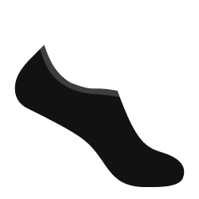

# SOQUETTE
(also written as Socquette, soquettes are a kind of short socks)

Soquette aims to be a fully featured web application framework 
centered around granular reactivity and working close to the dom.

# W.I.P
This is work in progress! I'm currently exploring the different ways I can generate components.  

The current process is the following:
- UI is described in an AST fashion
- Classes are then generated
- HTML is rendered
- HTML is put in a file which then imports parts of the code
